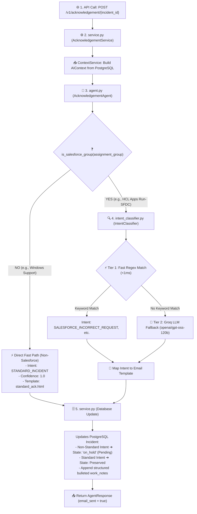

# 📘 Acknowledgement Agent — Detailed Code & Workflow Explanation

This document provides a clear, step-by-step breakdown of how the **Acknowledgement Agent** works in the Incident AI Platform. It explains the responsibilities, execution flow, logic, and exact code working of every file involved in the module.

---

## 🔄 1. High-Level Architecture & Execution Flow

When a ticket is created or triaged, the system executes the Acknowledgement Agent pipeline via `POST /v1/acknowledgement/{incident_id}`:

---

## 📁 2. File-by-File Breakdown

---

### File 1: `schemas.py` — The Blueprint (Data Structures)
📍 **Path**: [app/modules/agents/acknowledgement/schemas.py](file:///Users/jalajbalodi/PROJECT/backend/app/modules/agents/acknowledgement/schemas.py)

#### 💡 Role:
Defines strict Pydantic data schemas for classification intents, delivery logs, and agent response payloads.

#### 🔍 Key Code Components:

1. **`IntentType(str, Enum)`**:
   - `STANDARD_INCIDENT`: Standard break/fix technical issue.
   - `SALESFORCE_INCORRECT_REQUEST`: Salesforce access / profile update / permission request raised via Incident.
   - `ACCESS_REQUEST`: General SAP or Database permission request.
   - `SERVICE_REQUEST`: Hardware or software item order.
   - `WRONG_REQUEST`: Ticket submitted under wrong team or sandbox environment.

2. **`IntentResult(BaseModel)`**:
   - Holds the result of the classifier:
     - `intent`: Value from `IntentType`.
     - `confidence`: Score (`0.0` to `1.0`).
     - `reasoning`: Explanation string.

3. **`AcknowledgementResult(BaseModel)`**:
   - Schema returned inside `AgentResponse.result`:
     - `incident_id`, `incident_number`, `caller`, `assigned_to`, `assignment_group`.
     - `intent_info`: Nested `IntentResult`.
     - `template_used`: Selected template name (e.g. `salesforce_incorrect_request.html`).
     - `email_sent`: `true` (testing mode).
     - `delivery_status`: `"simulated_success"`.
     - `work_notes_added`: Structured bullet points saved to PostgreSQL.

---

### File 2: `intent_classifier.py` — The Brain (Fast Rules & Groq LLM)
📍 **Path**: [app/modules/agents/acknowledgement/intent_classifier.py](file:///Users/jalajbalodi/PROJECT/backend/app/modules/agents/acknowledgement/intent_classifier.py)

#### 💡 Role:
Evaluates ticket description and classifies intent using a **2-Tier Hybrid Approach**.

#### 🔍 Key Code Components:

1. **Tier 1 — Fast Regex Matching (`_fast_rule_match`, <1ms)**:
   - Scans text for high-precision regex patterns:
     - `SALESFORCE_PATTERNS`: `salesforce`, `sfdc`, `salesforce.com`, `gts`, `gem`, `eanz`, `profile update`.
     - `ACCESS_PATTERNS`: `access request`, `grant access`, `sap role`, `db access`.
     - `SERVICE_PATTERNS`: `new laptop`, `software license`, `hardware order`.
     - `WRONG_PATTERNS`: `wrong group`, `wrong team`, `sandbox`, `staging`.
   - **Result**: Immediate match returns `confidence=0.98` without calling the LLM.

2. **Tier 2 — Groq LLM Fallback (`classify_intent`)**:
   - If regex finds no keywords, invokes Groq LLM using model **`openai/gpt-oss-120b`**.
   - Passes `SYSTEM_PROMPT` instructing the AI to output valid JSON.
   - Parses response, strips `<think>` tags, and returns `IntentResult`.
   - Defaults to `STANDARD_INCIDENT` on any error or timeout.

---

### File 3: `agent.py` — The Router & Decision Maker
📍 **Path**: [app/modules/agents/acknowledgement/agent.py](file:///Users/jalajbalodi/PROJECT/backend/app/modules/agents/acknowledgement/agent.py)

#### 💡 Role:
Core logic sub-classing `BaseAgent`. Handles assignment group filtering and email template selection.

#### 🔍 Key Code Components:

1. **`is_salesforce_group(group_name)`**:
   - Checks if `assignment_group` matches `salesforce`, `sfdc`, `hcl apps run-sfdc`, or `salesforce support`.

2. **Non-Salesforce Groups (Direct Fast Path)**:
   - Immediately sets intent to `STANDARD_INCIDENT` with `confidence=1.0`.
   - Selects template `standard_ack.html`.

3. **Salesforce Groups (Intent Classification Path)**:
   - Calls `intent_classifier.classify_intent(...)`.
   - Maps intent to template:
     - `SALESFORCE_INCORRECT_REQUEST` ➔ `salesforce_incorrect_request.html`
     - `ACCESS_REQUEST` ➔ `wrong_ticket_access.html`
     - `SERVICE_REQUEST` ➔ `wrong_ticket_service_catalog.html`
     - `WRONG_REQUEST` ➔ `wrong_org_environment.html`
     - Default Fallback ➔ `standard_ack.html`

---

### File 4: `service.py` — The Orchestrator & PostgreSQL Writer
📍 **Path**: [app/modules/agents/acknowledgement/service.py](file:///Users/jalajbalodi/PROJECT/backend/app/modules/agents/acknowledgement/service.py)

#### 💡 Role:
Coordinates context building, agent execution, database state transitions, and work notes updates in PostgreSQL.

#### 🔍 Key Code Components (`process_acknowledgement`):

1. **Context Assembly**:
   - Loads incident from DB via `IncidentService`.
   - Builds `AIContext` via `ContextService`.

2. **Agent Reason Phase**:
   - Calls `AcknowledgementAgent.run(request)`.

3. **Database Write-Back**:
   - **Non-Standard Intents** (`SALESFORCE_INCORRECT_REQUEST`, etc.):
     - Updates ticket state to `"on_hold"` (`Pending` in UI).
     - Formulates bulleted audit work notes.
   - **Standard Incidents**:
     - Preserves current ticket state (`in_progress`).
     - Appends assignment work notes.
   - Saves updates using `IncidentService.update_incident(...)`.

4. **Response Formatting**:
   - Packages `AcknowledgementResult` with `email_sent=True` and `delivery_status="simulated_success"`.

---

## 📊 3. Summary Table of Module Responsibilities

| File Name | Function / Component | Input | Output / Primary Responsibility |
| :--- | :--- | :--- | :--- |
| **`schemas.py`** | Data Models | Field attributes | Validated Pydantic objects (`IntentResult`, `AcknowledgementResult`) |
| **`intent_classifier.py`** | Hybrid Classifier | Ticket description | Ticket Intent (`SALESFORCE_INCORRECT_REQUEST`, etc.) |
| **`agent.py`** | Template Router | `AIContext` | Selected HTML Template & Reasoning |
| **`service.py`** | Domain Orchestrator | `incident_id` | Database Update + Final `AgentResponse` JSON |
