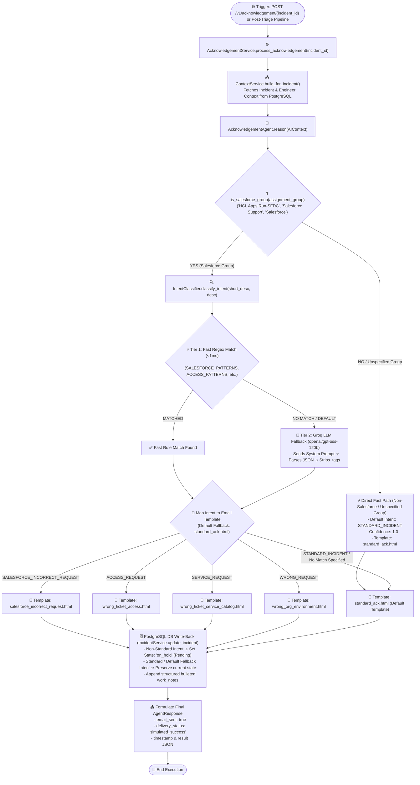

# 📘 Acknowledgement Agent — Code Execution Flowchart & Technical Architecture

## 1. Visual Code Flowchart (Mermaid)



---

## 2. Default Fallback Policy (`standard_ack.html`)

> [!IMPORTANT]
> **Default Template & Intent Rule**:
> If **no specific condition is matched or specified** (e.g. non-Salesforce assignment group, unknown keyword pattern, or fallback scenario), the Acknowledgement Agent **ALWAYS defaults to the Standard Template (`standard_ack.html`)** with intent `STANDARD_INCIDENT`.

### Fallback Rules across Code Layers:
1. **Assignment Group Check**: If `assignment_group` is not a Salesforce group or is empty/unspecified, execution immediately selects `standard_ack.html`.
2. **Intent Classification Fallback**: If LLM or fast rules fail to find a matching pattern, the classifier defaults to `STANDARD_INCIDENT`.
3. **Template Resolution Fallback**: `template_mapping.get(intent, "standard_ack.html")` ensures any unmapped intent safely falls back to `standard_ack.html`.
4. **Service Status Fallback**: Standard incidents preserve the active ticket state (`in_progress`) and log standard technical assignment work notes.

---

## 3. Detailed Working of Every File

### 1. `app/api/v1/acknowledgement.py`
- **Purpose**: Exposes the REST API endpoint layer.
- **Key Endpoint**: `POST /v1/acknowledgement/{incident_id}`
- **Working**: Receives HTTP request, instantiates `AcknowledgementService`, executes `process_acknowledgement(incident_id)`, and returns the JSON payload `AgentResponse`.

### 2. `app/modules/agents/acknowledgement/service.py`
- **Purpose**: Master domain orchestrator layer.
- **Working**:
  1. Calls `ContextService` to construct the full `AIContext` from PostgreSQL.
  2. Invokes `AcknowledgementAgent.run(request)`.
  3. Evaluates `intent_info.intent`:
     - If non-standard intent (`SALESFORCE_INCORRECT_REQUEST`, `ACCESS_REQUEST`, `SERVICE_REQUEST`, `WRONG_REQUEST`), sets `new_state = "on_hold"` (`pending` in ServiceNow UI).
     - If `STANDARD_INCIDENT` (or default fallback), preserves current incident state.
  4. Formulates structured bulleted `work_notes` text.
  5. Updates PostgreSQL `incidents` table via `IncidentService.update_incident(...)`.
  6. Returns `AcknowledgementResult` with `email_sent = True` and `delivery_status = "simulated_success"`.

### 3. `app/modules/agents/acknowledgement/agent.py`
- **Purpose**: Core reasoning subclass of `BaseAgent`.
- **Working**:
  1. Checks if `assignment_group` is a Salesforce group (`"salesforce"`, `"sfdc"`, `"hcl apps run-sfdc"`, `"salesforce support"`).
  2. **Non-Salesforce / Unspecified Groups**: Immediately bypasses intent classification, assigns `STANDARD_INCIDENT` with `1.0` confidence, and selects `standard_ack.html`.
  3. **Salesforce Groups**: Calls `IntentClassifier.classify_intent(short_description, description)`.
  4. Maps the classified intent to the corresponding HTML template file (defaulting to `standard_ack.html`).

### 4. `app/modules/agents/acknowledgement/intent_classifier.py`
- **Purpose**: Hybrid 2-tier classifier.
- **Working**:
  - **Tier 1 (Fast Regex Match, <1ms)**: Scans ticket description for keywords (`SALESFORCE_PATTERNS`, `ACCESS_PATTERNS`, `SERVICE_PATTERNS`, `WRONG_PATTERNS`).
  - **Tier 2 (Groq LLM Fallback)**: Sends structured prompt to Groq API using model **`openai/gpt-oss-120b`**, parses JSON, and defaults to `STANDARD_INCIDENT` if no match is specified.

### 5. `app/modules/agents/acknowledgement/schemas.py`
- **Purpose**: Pydantic data schemas.
- **Working**:
  - `IntentType` Enum: `STANDARD_INCIDENT`, `ACCESS_REQUEST`, `SERVICE_REQUEST`, `WRONG_REQUEST`, `SALESFORCE_INCORRECT_REQUEST`.
  - `IntentResult`: Holds `intent`, `confidence`, `reasoning`.
  - `AcknowledgementResult`: Output schema returned in `AgentResponse.result`.

### 6. HTML Templates (`app/modules/agents/acknowledgement/templates/`)
- **`standard_ack.html`**: Standard assignment notification email showing ticket details and assigned engineer (used as default for all unspecified conditions).
- **`salesforce_incorrect_request.html`**: Corporate email template containing 5 step-by-step instructions for IT Central (`https://sbdkproduction.service-now.com/esc`), contact email (`aman.mourya@sbdinc.com`), and sign-off.

---

## 4. Prompts & LLM Model Configuration

- **Groq Model Used**: `openai/gpt-oss-120b`
- **Groq Client Integration**: [app/ai_platform/llm/groq_client.py](file:///Users/jalajbalodi/PROJECT/backend/app/ai_platform/llm/groq_client.py)
- **System Prompt**:

```python
SYSTEM_PROMPT = """You are an IT Support Intent Classifier.
Classify the given IT incident into exactly ONE of the following categories:

1. SALESFORCE_INCORRECT_REQUEST: The ticket involves Salesforce access, profile update, permissions, Salesforce.com GTS (EANZ) & GEM, or SFDC access request raised via an Incident ticket.
2. STANDARD_INCIDENT: System outage, blue screen crash, service disruption, or hardware failure requiring an engineer's manual fix.
3. ACCESS_REQUEST: General system permission, SAP role, or DB access request.
4. SERVICE_REQUEST: Request for new software license, new laptop, equipment order, or hardware installation.
5. WRONG_REQUEST: Ticket submitted under an incorrect assignment group, wrong team, or wrong system environment.

Respond with ONLY valid JSON:
{
  "intent": "SALESFORCE_INCORRECT_REQUEST" | "STANDARD_INCIDENT" | "ACCESS_REQUEST" | "SERVICE_REQUEST" | "WRONG_REQUEST",
  "confidence": 0.95,
  "reasoning": "Brief explanation"
}
"""
```

---

## 5. Real Input & Output Payloads

### Case A: Default Fallback Ticket (Non-Salesforce / Unspecified Condition)

**cURL Request**:
```bash
curl -X POST "http://localhost:8001/v1/acknowledgement/INC0000006"
```

**JSON Output Response**:
```json
{
  "success": true,
  "agent_name": "AcknowledgementAgent",
  "reasoning": "Non-Salesforce assignment group 'Windows Support'. Selected simple standard template 'standard_ack.html'.",
  "confidence": 1.0,
  "result": {
    "incident_id": "e3958f54-0570-4dd8-b324-2f34dae4f0a0",
    "incident_number": "INC0000006",
    "caller": "Jane Doe",
    "assigned_to": "Swapna Maji",
    "assignment_group": "Windows Support",
    "intent_info": {
      "intent": "STANDARD_INCIDENT",
      "confidence": 1.0,
      "reasoning": "Non-Salesforce assignment group — sending simple standard acknowledgement template."
    },
    "template_used": "standard_ack.html",
    "email_sent": true,
    "delivery_status": "simulated_success",
    "work_notes_added": "Acknowledgement Agent executed successfully.\n• Incident classified as Standard Incident.\n• Ticket assigned to Swapna Maji (Windows Support).\n• User notified with assignment details.",
    "timestamp": "2026-08-20T12:15:53.806144Z"
  },
  "errors": [],
  "timestamp": "2026-08-20T12:15:53.795722Z"
}
```

### Case B: Salesforce Specific Ticket (`INC0000019` — `HCL Apps Run-SFDC`)

**cURL Request**:
```bash
curl -X POST "http://localhost:8001/v1/acknowledgement/INC0000019"
```

**JSON Output Response**:
```json
{
  "success": true,
  "agent_name": "AcknowledgementAgent",
  "reasoning": "Classified Salesforce intent as 'SALESFORCE_INCORRECT_REQUEST' (confidence: 0.98). Selected template 'salesforce_incorrect_request.html'.",
  "confidence": 0.98,
  "result": {
    "incident_id": "53187a6d-534b-45c1-9f3a-2230b4a8ed3a",
    "incident_number": "INC0000019",
    "caller": "Tina",
    "assigned_to": null,
    "assignment_group": "HCL Apps Run-SFDC",
    "intent_info": {
      "intent": "SALESFORCE_INCORRECT_REQUEST",
      "confidence": 0.98,
      "reasoning": "Matched Salesforce request keyword pattern '\\bsalesforce\\b'"
    },
    "template_used": "salesforce_incorrect_request.html",
    "email_sent": true,
    "delivery_status": "simulated_success",
    "work_notes_added": "Acknowledgement Agent executed successfully.\n• Incident classified as Salesforce Access / Update Request.\n• Request submitted under incorrect form for Salesforce.com GTS (EANZ) & GEM.\n• User notified to submit 'Application Access Request' RITM via IT Central.\n• Incident status updated to Pending.",
    "timestamp": "2026-08-20T12:15:34.169406Z"
  },
  "errors": [],
  "timestamp": "2026-08-20T12:15:34.164477Z"
}
```
