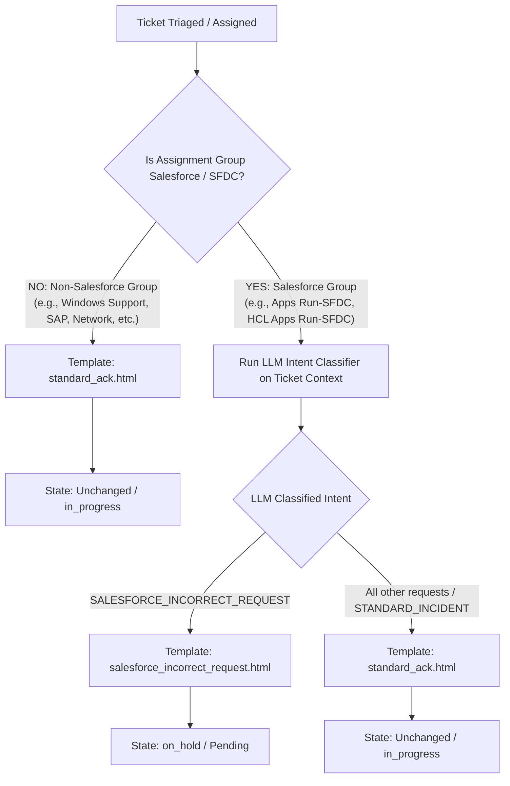

# Acknowledgement Agent — Template Trigger Conditions & Rules Guide

This document provides a comprehensive breakdown of the conditions under which templates are selected and dispatched by the **Acknowledgement Agent**, including exact matching logic for **Assignment Group**, **Short Description**, **Description**, and resulting **Ticket State**.

---

## 1. High-Level Decision Flow

The Acknowledgement Agent supports two active template paths:
1. **`salesforce_incorrect_request.html`**: For tickets where the caller requested Salesforce access, profile updates, or module access via an Incident form instead of an RITM.
2. **`standard_ack.html`**: For **all** other incidents across all assignment groups (standard technical break/fix, outages, wrong environments, hardware/service inquiries, non-Salesforce queues, etc.).



### Assignment Group Gating Rule
In [`app/modules/agents/acknowledgement/agent.py`](file:///Users/jalajbalodi/Incident-ai-platform/backend/app/modules/agents/acknowledgement/agent.py):
- **Salesforce Detection**: Checks if `assignment_group` contains any of: `["salesforce", "sfdc", "hcl apps run-sfdc", "salesforce support"]` (case-insensitive).
- **Rule 1 (Non-Salesforce Groups)**: If the group is **NOT** a Salesforce group (e.g. `Apps Run-SAP - SD`, `Windows Support`, `Network Support`, `Database Support`, `Security Operations`), the LLM is bypassed entirely. The agent immediately uses `standard_ack.html` with confidence `1.0`.
- **Rule 2 (Salesforce Groups)**: If the group **IS** a Salesforce group:
  - If classified as `SALESFORCE_INCORRECT_REQUEST` -> uses `salesforce_incorrect_request.html` and moves ticket state to `on_hold`.
  - All other requests -> routed to `standard_ack.html` with intent `STANDARD_INCIDENT` and ticket state remains unchanged (`in_progress`).

---

## 2. Active Template Trigger Matrix

| # | Template File | Intent Type | Eligible Assignment Group | Short Description Signals | Description Signals | Resulting State | User Action Needed |
|---|---|---|---|---|---|---|---|
| 1 | `salesforce_incorrect_request.html` | `SALESFORCE_INCORRECT_REQUEST` | Salesforce / SFDC groups only (`Apps Run-SFDC`, `HCL Apps Run-SFDC`, etc.) | Access request, Profile update, Role permissions, Module mapping in SFDC | User submitted an **Incident** asking for access/roles in Salesforce GTS (EANZ) & GEM instead of raising an **RITM** | `on_hold` (Pending) | Must submit RITM via IT Central Portal (`Application Access Request`) |
| 2 | `standard_ack.html` | `STANDARD_INCIDENT` | **All non-Salesforce groups** AND **all other Salesforce tickets** (break/fix, bug, crash, environment, hardware, general inquiry) | System crashes, errors, bug reports, environment queries, hardware requests, general issues | Legitimate break/fix issues or any request not fitting the Salesforce RITM redirection | Unchanged (`in_progress`) | None (Engineer actively working on issue) |

---

## 3. In-Depth Breakdown

### Template 1: `salesforce_incorrect_request.html`
* **Intent**: `SALESFORCE_INCORRECT_REQUEST`
* **Ticket State Change**: Automatically changed to **`on_hold`** (Pending)
* **Target Audience**: Users submitting incidents for Salesforce user access, permission sets, profile updates, or module visibility.

#### Trigger Conditions:
1. **Assignment Group**: Must be a Salesforce queue:
   - `Apps Run-SFDC`
   - `HCL Apps Run-SFDC`
   - `Salesforce Support`
2. **Short Description Keywords & Patterns**:
   - `"Need access to Salesforce GTS EANZ"`
   - `"Salesforce profile update required"`
   - `"Requesting SFDC permission set / role assignment"`
   - `"Cannot view GEM module in Salesforce - grant access"`
   - `"Salesforce user provisioning"`
3. **Description Keywords & Patterns**:
   - Mentions needing read/write permissions, profile alterations, manager approval for Salesforce modules.
   - Mentions trying to gain initial access to Salesforce GTS (EANZ) or GEM.
   - The user used the **Incident** submission form rather than a service request (RITM).

#### Sample Incident Context:
```yaml
Assignment Group: "HCL Apps Run-SFDC"
Short Description: "Need access to Salesforce GTS EANZ"
Description: "Hi Team, I joined the sales team today and require access to Salesforce.com GTS EANZ module and GEM reporting. Please grant me standard sales rep permissions."
Category: "Applications"
Subcategory: "Salesforce"
```

#### What Gets Sent to User:
- **Email Subject**: `Salesforce Access & Update Request Notice - {ticket_number}`
- **Message Content**:
  > *"This is not the correct form for Salesforce access or Profile Update requests. For access or updates in Salesforce.com GTS (EANZ) & GEM, you need to raise a Request Item (RITM) via IT Central (https://sbdkproduction.service-now.com/esc) -> Search 'Application Access Request' -> Select 'Salesforce.com GTS (EANZ) & GEM'."*

---

### Template 2: `standard_ack.html`
* **Intent**: `STANDARD_INCIDENT`
* **Ticket State Change**: **None** (remains in `in_progress` or assigned state)
* **Target Audience**: All regular incident callers whose issues represent legitimate break/fix technical problems, as well as any other request not classified as a Salesforce incorrect RITM.

#### Trigger Conditions:
This template is chosen for:

##### Scenario A: Any Non-Salesforce Assignment Group
If `assignment_group` is **NOT** a Salesforce queue:
- **Assignment Groups**:
  - `Apps Run-SAP - SD`
  - `Windows Support`
  - `Network Support`
  - `Application Support`
  - `Database Support`
  - `Security Operations`
  - `Cloud Infrastructure`
  - `Network Operations`
  - `Service Desk`
- **Logic**: Automatically selects `standard_ack.html` without invoking LLM.

##### Scenario B: Salesforce Assignment Group (Everything other than Salesforce Access/RITM)
If `assignment_group` is Salesforce (`Apps Run-SFDC`, `HCL Apps Run-SFDC`), but the issue is:
- A genuine technical defect / error (e.g. Apex CPU timeout, 500 error, integration failure)
- An environment or sandbox inquiry
- Hardware or license inquiry
- General inquiry or troubleshooting ticket
- **Logic**: Evaluated as `STANDARD_INCIDENT` -> `standard_ack.html`.

#### What Gets Sent to User:
- **Email Subject**: `Incident Assignment Notification - {ticket_number}`
- **Message Content**:
  > *"Your support ticket has been triaged and assigned to our technical operations team for investigation. Our engineer, {assigned_engineer_name}, is actively reviewing your issue and will update you via work notes as progress is made."*

---

## 4. Summary Architecture

```
                         TICKET INGESTION
                                |
               +----------------+----------------+
               |                                 |
     NON-SALESFORCE GROUP                SALESFORCE GROUP
               |                                 |
       (Windows, SAP, Network, etc.)      (Apps Run-SFDC, HCL Apps Run-SFDC)
               |                                 |
       [standard_ack.html]             LLM INTENT CLASSIFICATION
      State: IN_PROGRESS                         |
                                +----------------+----------------+
                                |                                 |
                  Access / RITM via Incident              All Other Requests
                                |                                 |
                  [salesforce_incorrect_request.html]     [standard_ack.html]
                          State: ON_HOLD                  State: IN_PROGRESS
```
