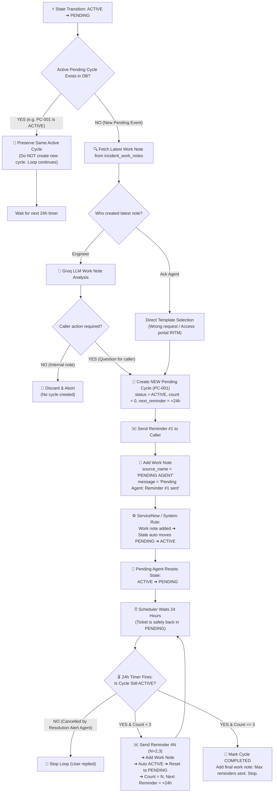

# 🤖 Pending Agent — Final Architecture & Workflow Specification

## 1. Role & Core Separation of Concerns

From the finalized architectural design, the boundaries between the **Pending Agent** and the **Resolution Alert Agent** are strictly decoupled:

* **Pending Agent (Reminder Sender)**:
  * **Trigger Direction**: Handled ONLY when incident transitions from **`Active ➔ Pending`**.
  * **Responsibilities**:
    * Cycle creation (if no active cycle exists).
    * Work note LLM analysis (determine if engineer asked a user question).
    * Reminder template rendering using a single unified `standard_pending_reminder.html`.
    * Simulated email delivery (`email_sent: True`, `delivery_status: "simulated_success"` — no third-party API integration used for now).
    * Work note logging (`source_name: PENDING AGENT`).
    * State reset (**`Active ➔ Pending`** after ServiceNow auto-activation).
    * 24-hour loop monitoring and execution.
  * **Does NOT**: Decide to close or cancel cycles when users reply (that is exclusively handled by the Resolution Alert Agent).

* **Resolution Alert Agent (Cycle Controller)**:
  * **Trigger Direction**: Handled ONLY when incident transitions from **`Pending ➔ Active`**.
  * **Responsibilities**:
    * Inspects the source of activation.
    * Decides whether to **CLOSE/CANCEL** (if User replied or engineer manually activated) or **PRESERVE** (if Pending Agent auto-bounce).
    * Alerts/pings the assigned engineer when user responds.
  * **Does NOT**: Ever change state back to Pending.

---

## 2. Standardized Module Structure (Matching Agent 1 & Agent 2)

The Pending Agent follows the identical module layout established by `triage` (Agent 1) and `acknowledgement` (Agent 2):

```text
backend/app/modules/agents/pending/
├── __init__.py
├── agent.py                      # PendingAgent (inherits BaseAgent, pure reasoning)
├── service.py                    # PendingService (orchestrator: DB, cycle, SN, scheduler)
├── work_note_analyzer.py         # LLM Prompt caller (checks caller action required)
├── reminder_generator.py         # Dynamic email template builder
├── schemas.py                    # Pydantic schemas (Cycle, Analysis, AgentResponse payload)
├── repository.py                 # DB queries for pending_cycles
├── scheduler.py                  # 24-hour background poller / timer execution
├── models/
│   ├── __init__.py
│   └── pending_cycle.py          # SQLAlchemy model for pending_cycles table
└── templates/
    └── standard_pending_reminder.html # Unified standard reminder template (Reminders 1, 2, 3)
```

---

## 3. Database Schema: `pending_cycles`

This table integrates directly with `incidents` and the `incident_work_notes` table:

| Column | Type | Description |
| :--- | :--- | :--- |
| `id` | `String(36)` (PK) | Cycle identifier (e.g., `PC-001`, UUID) |
| `incident_id` | `String(36)` (FK) | Foreign key to `incidents.id` |
| `incident_number` | `String(20)` | `INC0000043` |
| `status` | `Enum` | `ACTIVE`, `COMPLETED`, `CANCELLED` |
| `reminder_count` | `Integer` | `0` ➔ `1` ➔ `2` ➔ `3` |
| `max_reminders` | `Integer` | Fixed at `3` |
| `source_type` | `String(50)` | `ENGINEER` or `ACKNOWLEDGEMENT_AGENT` |
| `next_reminder_at`| `DateTime` | Next scheduled reminder execution (`NOW() + 24h`) |
| `created_at` | `DateTime` | Cycle inception timestamp |
| `updated_at` | `DateTime` | Last status/reminder update |

---

## 4. Complete End-to-End Workflow Diagram



---

## 5. Detailed Phase Breakdown

### Phase 1: Ingestion & Idempotency Gate
1. Incident transitions to `on_hold` / `pending`.
2. `PendingService` checks `pending_cycles`:
   * `SELECT * FROM pending_cycles WHERE incident_id = :id AND status = 'ACTIVE'`.
   * **If active cycle exists**: This state change was caused by the Pending Agent resetting the ticket back to pending after a work note was added. **Preserve the cycle and exit immediately**.
   * **If no active cycle exists**: This is a genuine external pending request. Proceed to Phase 2.

### Phase 2: Intake & LLM Reasoning (`agent.py` + `work_note_analyzer.py`)
1. Read the latest record from `incident_work_notes` for this ticket.
2. **If `source_name == "Acknowledgement Agent"`**:
   * Skip LLM analysis. Directly map to the clarification template (e.g. asking user to raise an Application Access RITM).
3. **If `source_name == Engineer`**:
   * Send ticket metadata + latest work note text to Groq LLM (`openai/gpt-oss-120b`).
   * **Prompt Output**:
     ```json
     {
       "is_caller_action_required": true,
       "reasoning": "Engineer is asking the user for error screenshots to proceed with troubleshooting.",
       "confidence": 0.95
     }
     ```
   * If `is_caller_action_required == false` (e.g. "Waiting for vendor server restart"): **Discard and stop**. Do not create a cycle.

### Phase 3: Cycle Creation & Reminder #1 (Simulated Delivery)
1. Insert new row in `pending_cycles`:
   * `id = "PC-001"`, `status = "ACTIVE"`, `reminder_count = 1`, `next_reminder_at = NOW() + 24h`.
2. Render `standard_pending_reminder.html` populated with:
   * `incident_number`, `caller`, `reminder_count=1`, `max_reminders=3`, `assigned_to`.
3. **Simulated Email Delivery**:
   * No third-party email provider API (Resend / SendGrid / Brevo) is called at this stage.
   * Exactly like the Acknowledgement Agent, the agent returns `email_sent = True` and `delivery_status = "simulated_success"`.
4. Insert into `incident_work_notes`:
   * `source_name = "PENDING AGENT"`
   * `message = "Pending Agent: Reminder #1 sent to user (simulated). Awaiting user response."`

### Phase 4: The Immediate State Reset (`Active ➔ Pending`)
> [!IMPORTANT]
> **Why this happens**: In ServiceNow, adding any work note automatically changes ticket state from **`Pending ➔ Active`**.
> **How Pending Agent handles it**:
> 1. Right after the Pending Agent logs the reminder work note (`source_name = "PENDING AGENT"`), ServiceNow triggers the ticket to `Active`.
> 2. The Resolution Alert Agent checks the work note, sees it was added by `"PENDING AGENT"`, and ignores it (`PRESERVE` cycle).
> 3. **The Pending Agent immediately resets the ticket state back to `PENDING` (`Active ➔ Pending`)**.
> 4. When the state enters `Pending`, Phase 1 idempotency check detects that active cycle `PC-001` already exists ➔ **It preserves the cycle and does NOT create a duplicate cycle**.
> 5. **Result**: The ticket stays in `Pending` state while waiting for the next 24-hour reminder or user response.

### Phase 5: The 24-Hour Timer Loop (`scheduler.py`)
1. A background cron job queries every 5 minutes:
   * `SELECT * FROM pending_cycles WHERE status = 'ACTIVE' AND next_reminder_at <= NOW()`.
2. Before sending an email, it verifies the cycle has not been cancelled by the Resolution Alert Agent (e.g., user replied 2 hours ago).
3. If still active:
   * **Reminder #2 (at +24h)**: Increment `reminder_count = 2`, render `standard_pending_reminder.html` with `reminder_count=2`, simulate delivery (`email_sent=True`), add work note, execute state bounce, set `next_reminder_at = NOW() + 24h`.
   * **Reminder #3 (at +48h)**: Increment `reminder_count = 3`, render `standard_pending_reminder.html` with `reminder_count=3` (final reminder indicator), simulate delivery (`email_sent=True`), add work note, execute state bounce.
   * **After Reminder #3 (at +72h)**: If still no reply, mark cycle status as **`COMPLETED`**. Post final note: `"Pending Agent: Maximum reminders (3/3) reached. No response from user. Cycle completed."`

---

## 6. How It Interacts With Later Actions (When User Replies)

* When user eventually replies, ServiceNow moves state from **Pending ➔ Active**.
* The **Resolution Alert Agent** fires, sees `source_name == "Tina (User)"`, queries `pending_cycles`, finds active cycle `PC-001`, and marks it **`CANCELLED`** (`cancellation_reason = "user_replied"`).
* If the engineer later investigates and sets the ticket to Pending *again*, the Pending Agent will find **0 active cycles** and smoothly start a brand new cycle (`PC-002`)!
